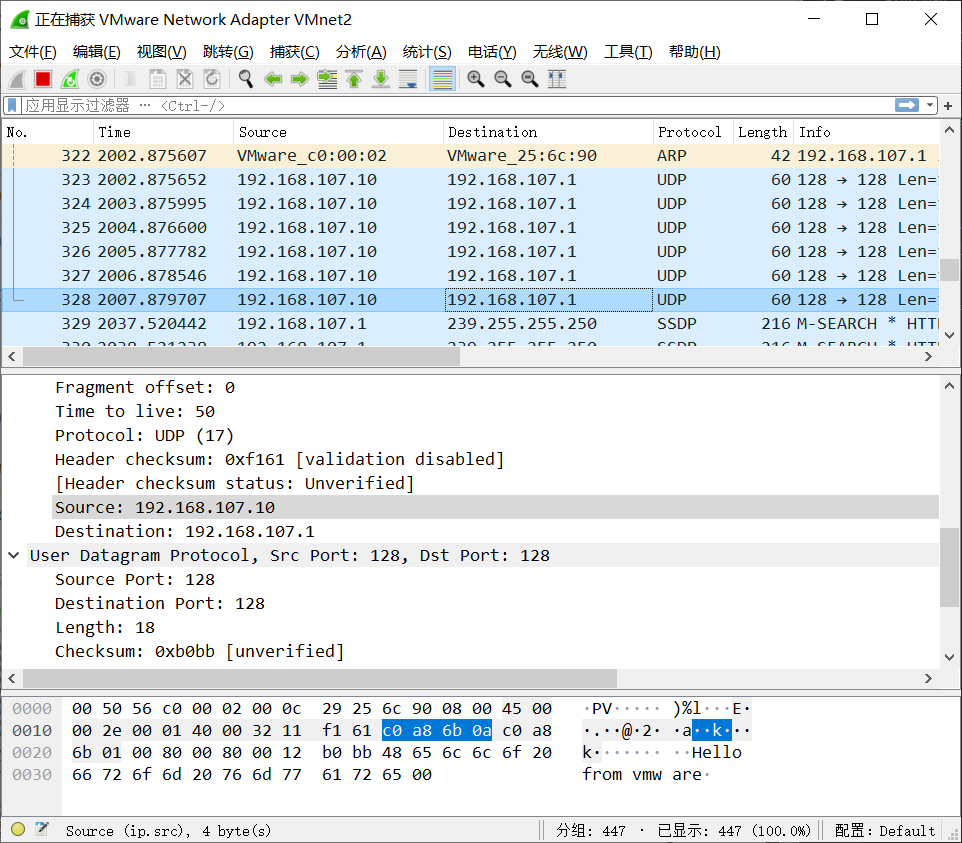

# Part 2 Report

在本次实验中，我主要实现了使用`DPDK`从虚拟机上往主机发送UDP包。

## 实现
1. 配置好`DPDK`的运行环境(大页、绑定网卡)，这里按照文档上的方法进行的配置。
2. 在代码中初始化绑定到`DPDK`的虚拟网卡，具体的初始化方法和`skeleton`基本上一致。
和skeleton不一样的是，`skeleton`主要是将一个port上收到的包通过另一个port发送出去，包的内容也没有丝毫更改。而在我的实现中，收包发包使用的是同一个port，因此在我的实现中仅仅需要绑定一个网卡即可。
```c
/* Allocate and set up 1 RX queue per Ethernet port. */
	for (q = 0; q < rx_rings; q++) {
		retval = rte_eth_rx_queue_setup(port, q, RX_RING_SIZE,
				rte_eth_dev_socket_id(port), NULL, mbuf_pool);
		if (retval < 0)
			return retval;
	}

	/* Allocate and set up 1 TX queue per Ethernet port. */
	for (q = 0; q < tx_rings; q++) {
		retval = rte_eth_tx_queue_setup(port, q, TX_RING_SIZE,
				rte_eth_dev_socket_id(port), NULL);
		if (retval < 0)
			return retval;
	}
```
**注意虚拟机里的网卡最好使用文档上的host only模式并且不要选择DHCP协议**


3. 在同一个局域网内发包，需要知道目标机器的`MAC地址`，而我们只知道`IP地址`，因此需要通过`ARP协议`得到目标机器的`MAC地址`
```c
static void
get_macaddr_arp(uint8_t port, struct rte_mempool* mbuf_pool, \
    uint32_t my_ip, struct ether_addr *my_macadd, \
    uint32_t dst_ip, struct ether_addr *dst_macaddr)
```
这个函数中主要的动作就是，构建ethernet包；然后广播出去；然后收包解析得到target机器的mac地址。

4. 构建UDP包并发送到指定的目标机器
```c
static __attribute__((noreturn)) void 
send_pkt_to_host(uint8_t port, struct rte_mempool *mbuf_pool, \
    uint32_t my_ip, struct ether_addr *my_macaddr, \
    uint32_t dst_ip, struct ether_addr *dst_macaddr)
```
这个函数里是一个死循环，不断发送UDP包，然后睡眠1s，再继续发包、睡眠...

包的payload是`Hello from vmware`。

## 验证
验证正确性，按照文档上的说明，使用的是wireshark。由于我的虚拟机里绑定的是`vmnet2`的网卡，因此在验证时，我使用wireshark监听`vmnet2`接口。
监听结果如下:


可以看到，我们在wireshark上正确监听到了UDP包，并且payload为`Hello from vmware`，这和我的代码中写的payload也是一致的。