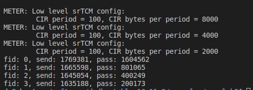

# Lab 3 report —— QoS using srTcm and WRED

## Implementation
本次实现中主要使用了dpdk中关于meter和red的API。整体的算法过程大致如下:
1. 初始化meter和red的配置
2. 针对每个包标记颜色，并将标记的颜色返回给调用者
3. 利用已经标记好的颜色和配置来决定这个包是否被丢弃。

由于是模拟环境，假设发包是每1ms将队列中所有的包发送出去。因此每经过1ms的模拟时间，将队列清空

下面介绍使用到的API

### rte_meter
```c
struct rte_meter_srtcm_params {
	uint64_t cir; /**< Committed Information Rate (CIR). Measured in bytes per second. */
	uint64_t cbs; /**< Committed Burst Size (CBS).  Measured in bytes. */
	uint64_t ebs; /**< Excess Burst Size (EBS).  Measured in bytes. */
};

/* Internal data structure storing the srTCM run-time context per metered traffic flow. */
struct rte_meter_srtcm {
	uint64_t time; /* Time of latest update of C and E token buckets */
	uint64_t tc;   /* Number of bytes currently available in the committed (C) token bucket */
	uint64_t te;   /* Number of bytes currently available in the excess (E) token bucket */
	uint64_t cbs;  /* Upper limit for C token bucket */
	uint64_t ebs;  /* Upper limit for E token bucket */
	uint64_t cir_period; /* Number of CPU cycles for one update of C and E token buckets */
	uint64_t cir_bytes_per_period; /* Number of bytes to add to C and E token buckets on each update */
};
```
meter初始化时主要使用到了以上两种结构体，其中`rte_meter_srtcm_params`是我调用初始化API时传入的参数，dpdk的API将会根据我的参数来初始化`rte_meter_srtcm`结构体。

**初始化`rte_meter_srtcm`结构体的API如下**：

```c
int
qos_meter_init(void)
{
    uint64_t hz[] = {1000000, 1000000, 1000000, 1000000};
    for (uint32_t i = 0; i < APP_FLOWS_MAX; i++) {
        app_meter_srtcm[i].tc = app_meter_srtcm [i].cbs = app_srtcm_params[i].cbs;
        app_meter_srtcm[i].te = app_meter_srtcm [i].ebs = app_srtcm_params[i].ebs;
        app_meter_srtcm[i].time = 0;

        rte_meter_get_tb_params(hz[i], app_srtcm_params[i].cir, 

            &app_meter_srtcm[i].cir_period, &app_meter_srtcm[i].cir_bytes_per_period);
        RTE_LOG(INFO, METER, "Low level srTCM config: \n"

            "\tCIR period = %" PRIu64 ", CIR bytes per period = %" PRIu64 "\n",

            app_meter_srtcm[i].cir_period, app_meter_srtcm[i].cir_bytes_per_period);
    }
    return 0;
}
```
`qos_meter_init`的实现主要参考了dpdk中的`rte_meter_srtcm_config`。之所以没有直接调用它的API，是因为我们的time是模拟的，需要设置成0，因此我直接模仿它写了初始化函数。其中`rte_meter_get_tb_params`是用来计算`cir_period`和`cir_bytes_per_period`两个参数的，因为dpdk中设置了最小的`cir_period`，因此主要是该函数中判断计算出来的参数是不是小于最小值，如果是则返回最小值并且相应设置`cir_bytes_per_period`。

**标记颜色的API如下**
```c
static inline enum rte_meter_color
rte_meter_srtcm_color_blind_check(struct rte_meter_srtcm *m,
	uint64_t time,
	uint32_t pkt_len);
```
该函数接受srtcm的配置，当前时间，包长度三个函数。处理逻辑主要是
1. 计算时间差，添加新的token到桶中
2. 从桶中扣除响应的token，如果tc足够，那么返回绿色；如果tc不够但是te足够，返回黄色；否则不更改，返回红色。

### rte_red


**初始化dropper的API如下**
```c
int
rte_red_rt_data_init(struct rte_red *red);

int
rte_red_config_init(struct rte_red_config *red_cfg,
	const uint16_t wq_log2,
	const uint16_t min_th,
	const uint16_t max_th,
	const uint16_t maxp_inv);
```

`rte_red_rt_data_init`做的事情很简单，就是初始化`rte_red`，全部设为默认值。

`rte_red_config_init`做的事情也不复杂，主要就是判断给定的四个参数是不是都符合预期，比如`min_th` 应该小于 `max_th`等等。如果参数正常，则初始化一些全局变量并将配置写入到 `rte_red_config`中。

**dropper随即丢弃包的API如下**
```c
static inline int
rte_red_enqueue(const struct rte_red_config *red_cfg,
	struct rte_red *red,
	const unsigned q,
	const uint64_t time)
```
这个API比较复杂，在dpdk的实现中，主要拆成了很多个函数模块封装了逻辑。当`q`为0的时候，会调用`rte_red_enqueue_empty`，否则调用`rte_red_enqueue_nonempty`. 

不管是`rte_red_enqueue_empty`还是`rte_red_enqueue_nonempty`，逻辑都差不多。主要有以下几个步骤

1. 评估avg_queue_sz
2. 当平均队列长度大于min_th开始随机丢弃，当平均队列长度大于max_th开始全部丢弃，否则接收包。

两者的区别主要在于计算平均队列长度的算法不太一样。

## Deduce params
```c
struct rte_meter_srtcm_params app_srtcm_params[] = {
    {.cir = 1000000 * 160, .cbs = 80000, .ebs = 80000},
    {.cir = 1000000 * 80, .cbs = 70000, .ebs = 10000},
    {.cir = 1000000 * 40, .cbs = 30000, .ebs = 10000},
    {.cir = 1000000 * 20, .cbs = 15000, .ebs = 5000}
};

// app red parameters
struct rte_red_params app_red_params[APP_FLOWS_MAX][APP_METER_COLORS] = {
    {
        {.min_th = 1000, .max_th = 1020, .maxp_inv = 250, .wq_log2 = 10}
        {.min_th = 1000, .max_th = 1020, .maxp_inv = 250, .wq_log2 = 10},
        {.min_th = 0, .max_th = 250, .maxp_inv = 100, .wq_log2 = 4}
    },
    {
        {.min_th = 1000, .max_th = 1020, .maxp_inv = 250, .wq_log2 = 9},
        {.min_th = 900, .max_th = 1020, .maxp_inv = 10, .wq_log2 = 4},
        {.min_th = 0, .max_th = 1, .maxp_inv = 1, .wq_log2 = 1}
    },
    {
        {.min_th = 1000, .max_th = 1020, .maxp_inv = 250, .wq_log2 = 9},
        {.min_th = 900, .max_th = 1020, .maxp_inv = 10, .wq_log2 = 4},
        {.min_th = 0, .max_th = 1, .maxp_inv = 1, .wq_log2 = 1}
    },
    {
        {.min_th = 1000, .max_th = 1020, .maxp_inv = 250, .wq_log2 = 9},
        {.min_th = 900, .max_th = 1020, .maxp_inv = 10, .wq_log2 = 4},
        {.min_th = 0, .max_th = 1, .maxp_inv = 1, .wq_log2 = 1}
    }
};
```

由于在我们的模拟环境中flow 0的带宽在不丢包的情况下已经达到了1.28Gbps，因此我的策略主要是提高flow 0的优先级，尽量让flow 0的包不会丢。

在以上目标的基础上，我还要尽量控制四个flow的流量成 8:4:2:1 比例。

针对以上的目标我大概从两个方向上出发(最后只实现了一种)
1. 主要修改meter的配置，使得成比例8:4:2:1
2. 主要修改red的配置，使得丢包概率8:4:2:1

最后我选择了第一种方法实现，原因很简单，第一种方法要简单得多，第二种方法计算比例可能会稍微复杂一点。

可以看到，我在设置cir的时候，是按照比例进行设置的。之所以设置成这个级别大小的数字也是有道理的。因为cir是每秒补充到bucket中的bytes数。我们的最低要求，即每个我们想要的包，在经过meter时候都被标记为绿色或者黄色。那么要达到1.28Gbps，就是要达到160MBps。因此在flow 0的cir设置中，我填写了1000000 * 160，相应的其他flow也是按照比例分配下来。

这样可以保证每个flow的包在经过meter之后，拿到绿色或者黄色的包是成8:4:2:1比例的。

既然已经成比例了，我们就要保证这些绿色的包以及黄色的包都尽可能的被接受，而红色的包被丢弃。

因此在red的配置中，红色的包我基本上都丢弃了，可以看到我的max_th设置的很小。而对于flow1, 2, 3绿色和黄色的配置也都差不多，只有flow 0不一样。

这是因为，我们要尽可能的让flow 0的包全部通过，因为理论上，随机数取的好的话，全部通过的流量才是1.28Gbps。


但是还有一个问题，我们的模拟环境并不是很好的随机数，flow 0的发送的byte数有时会很低，只有1,400,000；而有时候又会很高，高达1,800,000。

刚开始的时候，我让flow 0尽量被标记为绿包，于是cbs给了10,000多，但是后来发现，这样会使得绿包的平均队列长度过长，导致因为太长而被丢弃。于是我就平衡了cbs和ebs，使得绿包和黄包差不多，并且更改了red的绿包和黄包配置，使得两者差不多。效果良好


效果如下：


可以看到，即使发包发了很多，比例以及流量基本上也满足条件




当发包数不够的时候，flow 0会尽可能的满足流量要求，而其他三个flow则按照正常比例进行接收。

